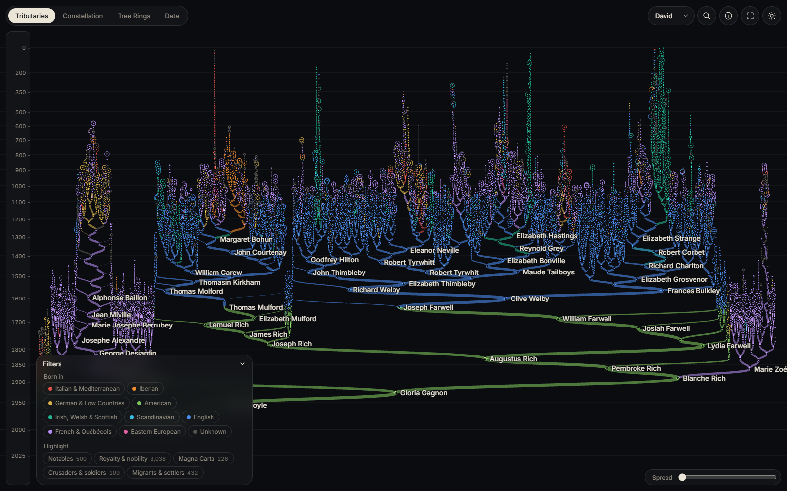
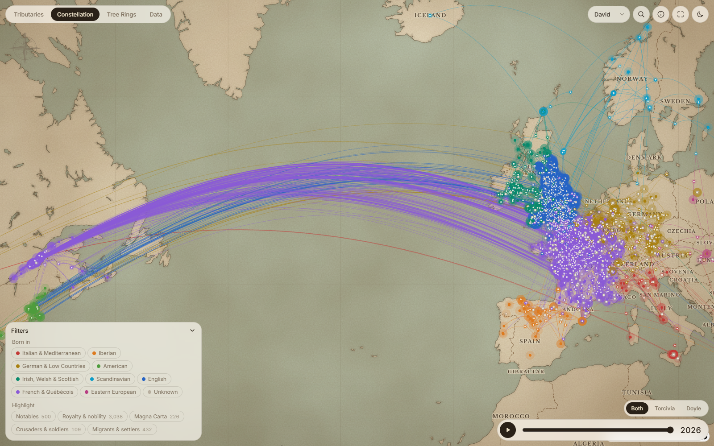
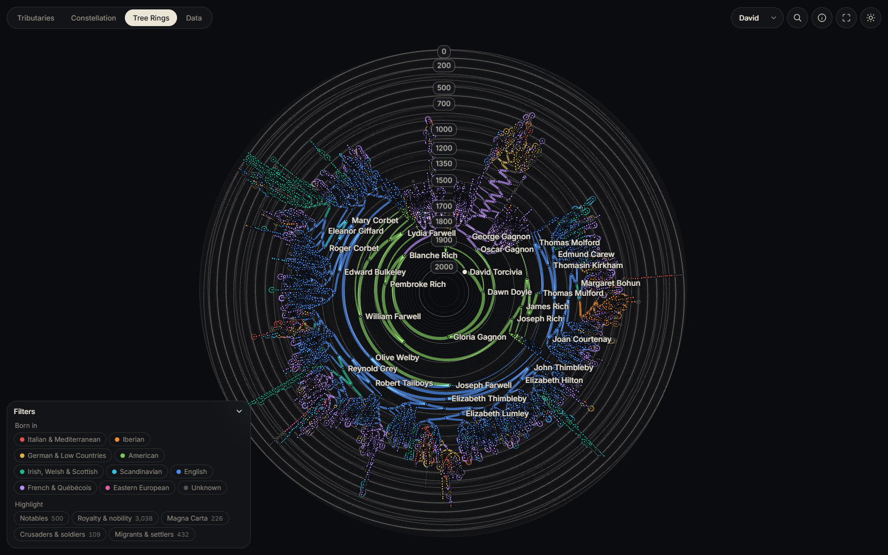
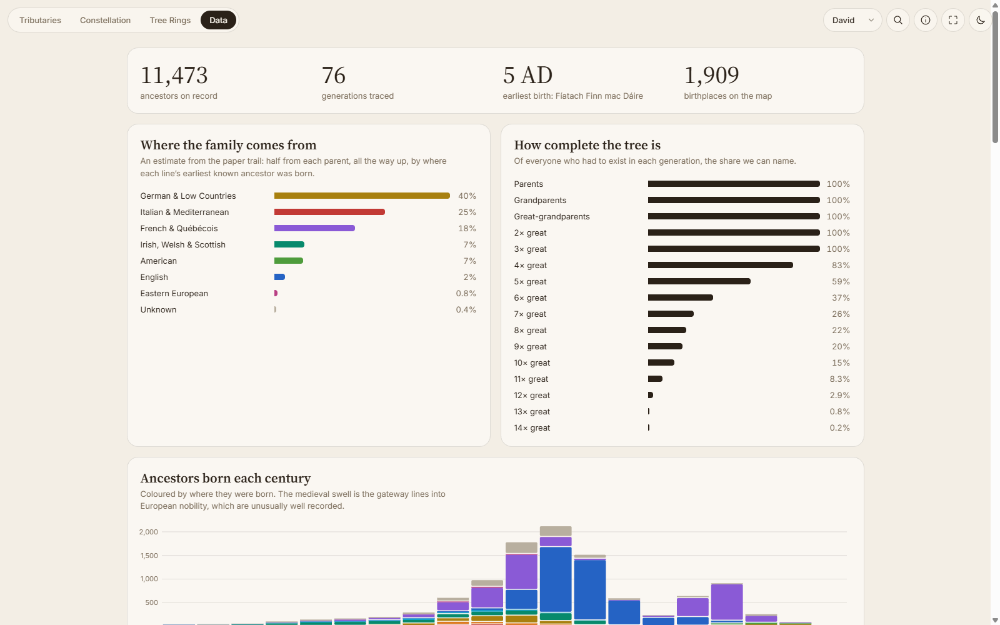

# Lineage

A local, GPU-rendered art piece for exploring every known direct ancestor of a WikiTree profile.

Views: **Tributaries** (strands through time), **Constellation** (birthplaces on a map, animated through the centuries),
**Tree Rings** (a radial cross-section of the family), plus a **Data** page of the tree in numbers.





| Tree Rings | Data |
| --- | --- |
|  |  |

## Run

```sh
python -m http.server 8765    # then open http://localhost:8765/
```

## Data

Nothing personal is committed. Everything fetched is kept in a local SQLite store, `lineage.db` (`store.py`), and saved
the moment it arrives, so an interrupted run loses nothing and nothing is fetched twice.

1. `python pull.py <WikiTree-ID> [authcode] [--kids]` pulls or updates ancestors, children, marriages, bios and categories.
   Re-runs walk the tree and fetch details only for profiles WikiTree marks as new or edited (`--kids` also re-checks
   every ancestor's children). For private profiles, get an authcode by visiting
   `https://api.wikitree.com/api.php?action=clientLogin&returnURL=http://localhost:8765/authed` while the server runs;
   the code appears in the server log, and the session is then kept in `.wt_cookies`.
2. `python geocode.py` geocodes each place once, verified against the rest of its name (county, state, country).
3. `python translate.py` translates non-English bios into English once each (Claude Message Batches API; needs
   `ANTHROPIC_API_KEY` or `ant auth login`). `--dry-run` shows what it would send.

The viewer reads the exported `tree.json`, `bios/<Id % 64>.json` and `places.json`.

## License

MIT, see `LICENSE`.
